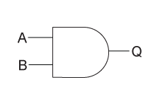
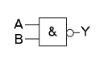

Comuter System Fundamentals: Lecture 1
==============
*2014-01-28T13:30:00-05:00*

## Logic Gates/Digital Circuits
  - Voltages correspond to signals
  - Two distinct signals (`0`/`1`, `false`/`true`, off/on)

    - Historically, (before integrated circuits) `0V` was off, `5V` was on (technically not that exact)
    - Actually more like a range (ex. `< 0.3V` is off, `> 4.6V` is on)

## The "Classical Trinity of Gates"

| Name  |           ANSI Symbol            |      IEC (European) Symbol     |                          Behavior                           |
|-------|----------------------------------|--------------------------------|-------------------------------------------------------------|
|  AND  |  |  | Outputs `true` if both inputs are `true`, `false` otherwise |
|  OR   |    |    | Outputs `true` if either input is `true`, `false` otherwise |
|  NOT  |  |  | Outputs the opposite of the input                           |

### Truth Tables

  - The discrete behavior of all logic gates can be described by "truth tables"
  - Indicate all possible inputs and their respective outputs
  - Operates on the binary domain, $B = \{ 0, 1 \}$

#### AND

$f: B \times B \mapsto B$  

| Input A | Input B | Output |
|---------|---------|--------|
|    0    |    0    |   0    |
|    1    |    0    |   0    |
|    0    |    1    |   0    |
|    1    |    1    |   1    |

#### OR

$f: B \times B \mapsto B$  

| Input A | Input B | Output |
|---------|---------|--------|
|    0    |    0    |   0    |
|    1    |    0    |   1    |
|    0    |    1    |   1    |
|    1    |    1    |   1    |

#### NOT

$f: B \mapsto B$  

| Input | Output |
|-------|--------|
|   0   |   1    |
|   1   |   0    |

## Universal Gates

  - Named because either alone could be used to create any other gate or any circuit imaginable (similarly an and/not or an or/not combination could be used to achieve the same effect)
  - These are the gates used by EEs when making other gates and circuits because of this "universal property"
  - The proof of this property is an exercise left to the reader

| Name  |            ANSI Symbol             |       IEC (European) Symbol      |                          Behavior                           |
|-------|------------------------------------|----------------------------------|-------------------------------------------------------------|
| NAND  |  |  | Outputs `false` if both inputs are `true`, `true` otherwise |
|  NOR  |    |    | Outputs `false` if either input is `true`, `true` otherwise |

### NAND

$f: B \mapsto B$

| Input A | Input B | Output |
|---------|---------|--------|
|    0    |    0    |   1    |
|    1    |    0    |   1    |
|    0    |    1    |   1    |
|    1    |    1    |   0    |

#### NOR

$f: B \times B \mapsto B$  

| Input A | Input B | Output |
|---------|---------|--------|
|    0    |    0    |   1    |
|    1    |    0    |   0    |
|    0    |    1    |   0    |
|    1    |    1    |   0    |

## Succinct  Gate Notation

  - Instead of drawing symbols, it is often easier to use a simpler notation system
  - When completing assignments it is important to note at the top which notation system you used (and preferably a table including all symbols and the name of the gate to which they correspond) to avoid confusion

| Gate |    Algebraic[^1]  | Alternate Algebraic | C/C++ Like  |
|------|-------------------|---------------------|-------------|
| AND  |   $A \wedge B$    | $A \cdot B$ or $AB$ |   `A & B`   |
|  OR  |    $A \vee b$     |       $A + B$       | `A | B`[^2] |
| NOT  | $\bar A$ or $A'$  |       $\sim A$      |    `!A`     |
| NAND |  $A \mid B$ [^3]  | $\sim (A \cdot B)$  | `!(A & B)`  |
| NOR  | $A \rightarrow B$ |   $\sim (A + B)$    | `!(A | B)`  |

[^1]: Generally regarded as the standard notation
[^2]: Note the confusion between this and the algebraic NAND
[^3]: Note the confusion between this and the C/C++ Like OR

## Finite Binary Space

  - Unlike in traditional mathematics, where examining all possible functions in a domain is impossible, there are only a finite number in the binary domain, so therefore all functions (and all inputs for each) can be examined

### One Dimensional to One Dimensional

$f: B \mapsto B$

  - Examples: NOT
  - 4 Possible Functions (note how identity, zero, and one are effectively useless)

| Input | &nbsp; | NOT | Identity | Zero | One |
|-------|--------|-----|----------|------|-----|
|   0   | &nbsp; |  1  |    0     |  0   |  1  |
|   1   | &nbsp; |  0  |    1     |  0   |  1  |

### Two Dimensional to One Dimensional

$f: B \times B \mapsto B$

- Examples: AND, OR, NAND, NOR
- 16 Possible Functions (note how a few are effectively useless)

| Input A | Input B | &nbsp; | AND | OR | NAND | NOR | XOR | XNOR | Equal | NOT Equal | NOT A | NOT B | Identity A | Identity B | Zero | One |
|---------|---------|--------|-----|----|------|-----|-----|------|-------|-----------|-------|-------|------------|------------|------|-----|
|    0    |    0    | &nbsp; |  0  | 0  |  1   |  1  |  0  |  1   |   1   |     0     |   1   |   1   |     0      |     0      |  0   |  1  |
|    1    |    0    | &nbsp; |  0  | 1  |  1   |  0  |  0  |  1   |   0   |     1     |   0   |   1   |     1      |     0      |  0   |  1  |
|    0    |    1    | &nbsp; |  0  | 1  |  1   |  0  |  0  |  1   |   0   |     1     |   1   |   0   |     0      |     1      |  0   |  1  |
|    1    |    1    | &nbsp; |  1  | 1  |  0   |  0  |  0  |  1   |   1   |     0     |   0   |   0   |     1      |     1      |  0   |  1  |

## Car Alarm Bell Example

  - In this example, we attempt to model the dinging bell in a car that indicates when the driver isn't wearing a seatbelt
    
    - Assume input from the seatbelt where 0 is open and 1 is closed
    - Assume input from the gearbox where 0 means safe and 1 means drive
    - Assume input from the engine where 0 meaning not running and 1 means running
    - When the seatbelt is not being used (opened), the car is in drive, and the engine is on, we want to send 1 to the bell to tell it to ding

### Truth Table

  - There is an algorithm that given a truth table (no matter how complex) can produce a circuit design with the proper gates to obtain the desired output

| Seatbelt | Gear | Engine | &nbsp; | Noise |
|----------|------|--------|--------|-------|
|    0     |  0   |   0    | &nbsp; |   0   |
|    0     |  0   |   1    | &nbsp; |   0   |
|    0     |  1   |   0    | &nbsp; |   0   |
|    0     |  1   |   1    | &nbsp; |   1   |
|    1     |  0   |   0    | &nbsp; |   0   |
|    1     |  0   |   1    | &nbsp; |   0   |
|    1     |  1   |   0    | &nbsp; |   0   |
|    1     |  1   |   1    | &nbsp; |   0   |

*[ANSI]: American National Standards Institute
*[IEC]: International Electrotechnical Commission