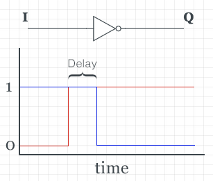
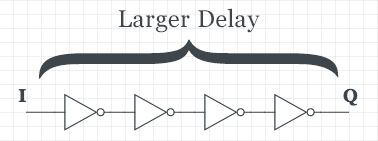
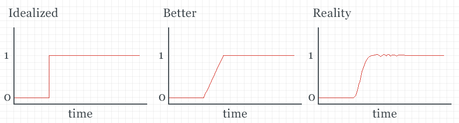
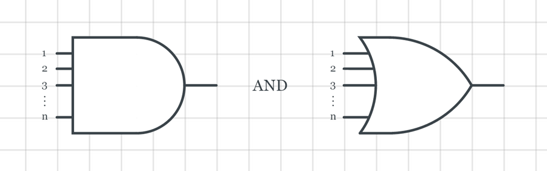
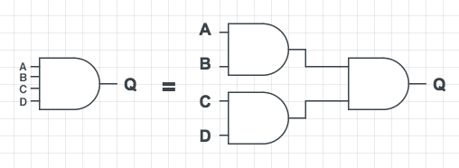
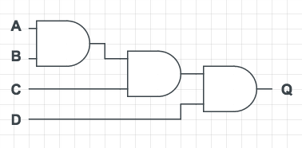
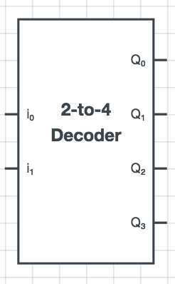
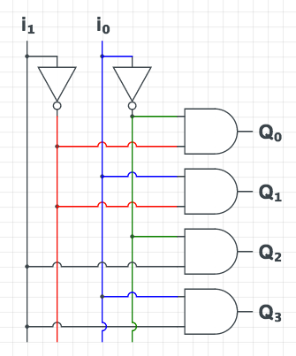

Computer System Fundamentals: Lecture 2
=======================================
*2015-01-30T13:30:00-05:00*

## Boolean Algebra Review

### Laws of the Neutral Elements

Listed in algebraic, alternate algebraic, and C/C++ like syntaxes, respectively:

  - **Identity**
    - $x \vee 0 = x$ or $x + 0 = x$ or `x | 0 = x`
    - $x \wedge 1 = x$ or $x \cdot 1 = x$ or `x & 1 = x`
    - $x \vee 1 = 1$ or $x + 1 = 1$ or `x | 1 = 1`
    - $x \wedge 0 = 0$ or $x \cdot 0 = 0$ or `x & 0 = 0`
    - $x \vee x = x$ or $x + x = x$ or `x | x = x`
    - $x \wedge x = x$ or $x \cdot x = x$ or `x & x = x`
    - $\bar a = x \text{ where } a = \bar x$ or $\sim (\sim x) = x$ or `!(!x) = x`
    - $x \vee \bar x = 1$ or $x + (\sim x) = 1$ or `x | !x = 1`
    - $x \cdot \bar x = 0$ or $x \wedge (\sim x) = 0$ or `x & !x = 0`

  - **Commutative**
    - $x \vee y = y \vee x$ or $x + y = y + x$ or `x | y = y | x`
    - $x \wedge y = y \wedge x$ or $x \cdot y = y \cdot x$ or `x & y = y & x`

  - **Associative**
    - $(x \vee y) \vee z = x \vee (y \vee z) = x \vee y \vee z$ or $(x + y) + z = x + (y + z) = x + y + z$ or `(x | y) | z = x | (y | z) = x | y | z`
    - $(x \wedge y) \wedge z = x \wedge (y \wedge z) = x \wedge y \wedge z$ or $(x \cdot y) \cdot z = x \cdot (y \cdot z) = x \cdot y \cdot z$ or `(x & y) & z = x & (y & z) = x & y & z`

  - **Distributive**
    - $x \wedge (y \vee z) = x \wedge y \vee x \wedge z$ or $x \cdot (y + z) = x \cdot y + x \cdot z$ or `x & (y | z) = x & y | x & z`
    - $x \vee (y \wedge z) = (x \vee y) \wedge (x \vee z)$ or $x + (y \cdot z) = (x + y) \cdot (x + z)$ or `x | (y & z) = (x | y) & (x | z)`
  
  - **DeMorgan's Law**
    - $\bar a = \bar x \wedge \bar y \text{ where } a = x \vee y$ or $\sim (x + y) = (\sim x) \cdot (\sim y)$ or `!(x | y) = !x & !y`
    - $\bar a = \bar x \vee \bar y \text{ where } a = x \wedge y$ or $\sim (x \cdot y) = (\sim x) + (\sim y)$ or `!(x & y) = !x | !y`

## Gates in the Real World

  - **Physics actually applies!**
  - In a not gate for example, switching states is not instant (and this time taken introduces a signal delay)

  - Chaining more gates (making the circuit "deeper") introduces more delay  

So, the more complex (deep the circuit), the more delay. Therefore, you must wait until the outputs are stable before reading them. This is called **propogation delay** (deep circuits are slower). Always opt for the less "deep" circuits because they are faster *and* cheaper.

Also, you must consider that the above graph is idealized. In reality, the signal is never completely stable and when it changes it osciallates for a short period after reaching its new state:

This phenomenon can be thought of as akin to a ball held by two springs. After movement, it takes some amount of time for drastic osciallations to stop and the ball to stabalize. In the real world, binary is not as definite as 0's and 1's. There are intermittent states, but for our purposes, we usually don't need to concern ourself with this. 

## Generalized Gates

What if we want an n-input AND/OR gate (doesn't make sense with a not gate)?

### Example: 4-input AND gate

This of course intoduces delay, but notice that it only produces $\log_2{n}$ levels (so therefore $C \log_2{n}$ propogation delay, where C is some delay constant) where n is the number of inputs. This approach is signifcantly better than the naïve (chained) approach:

This approach is slower because here there are $n - 1$ levels (and similarly $C(n - 1)$ propogation delay) for $n = 2c$ for $c \in \mathbb{Z}$.

In principle we can build an n-input AND gate. Our design (given our knowledge for this course) would produce a slow chained gate. We can ignorantly assume that n-gates are as fast as 2-input gates, because 2-input gates can be decomposed into their components to make an n-input gate

## Combinational Circuit

  - $n$ inputs and $m$ outputs

### Decoder

  - Takes an $n$ bit input and outputs $m$ bits (where $m = 2^n$) that uniquely represent each input combination
  - In a decoder, only one of the output bits is HIGH for each unique input combination
  - In the case of $n$ inputs and $m$ outputs, called a $n$-to-$m$ decoder

#### Example: 2-to-4 decoder

**Truth Table**

| $i_1$ | $i_0$ | &nbsp; | $Q_0$ | $Q_1$ | $Q_2$ | $Q_3$ |
|-------|-------|--------|-------|-------|-------|-------|
|   0   |   0   | &nbsp; |   1   |   0   |   0   |   0   |
|   0   |   1   | &nbsp; |   0   |   1   |   0   |   0   |
|   1   |   0   | &nbsp; |   0   |   0   |   1   |   0   |
|   1   |   1   | &nbsp; |   0   |   0   |   0   |   1   |

**Circuit Design**

You could also use an and gate for each time you needed a negated signal, but this is inefficient, because it uses more AND gates (where not-ing each signal initially only uses 2, this uses 4 in the case of a 2-to-4 decoder).
